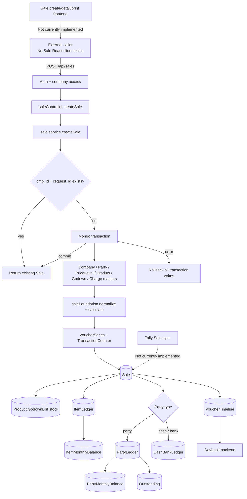
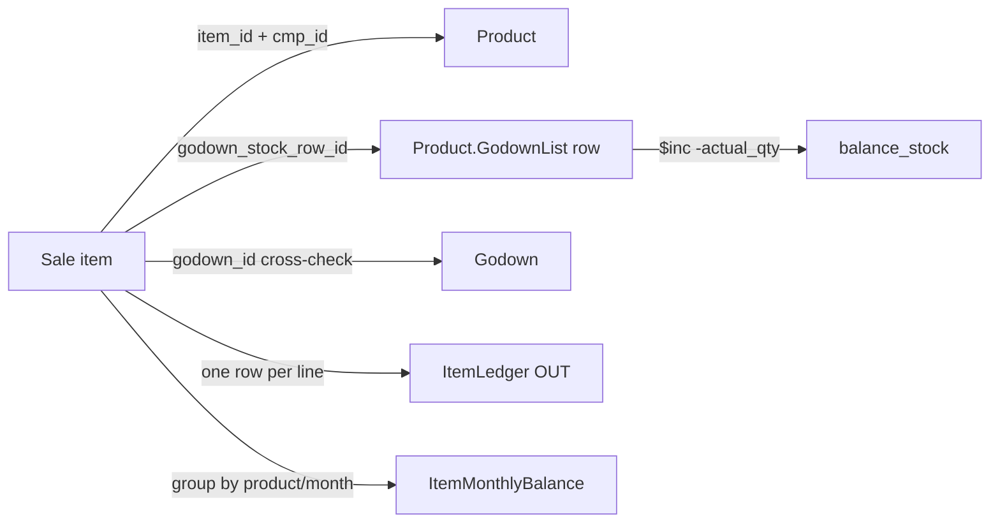
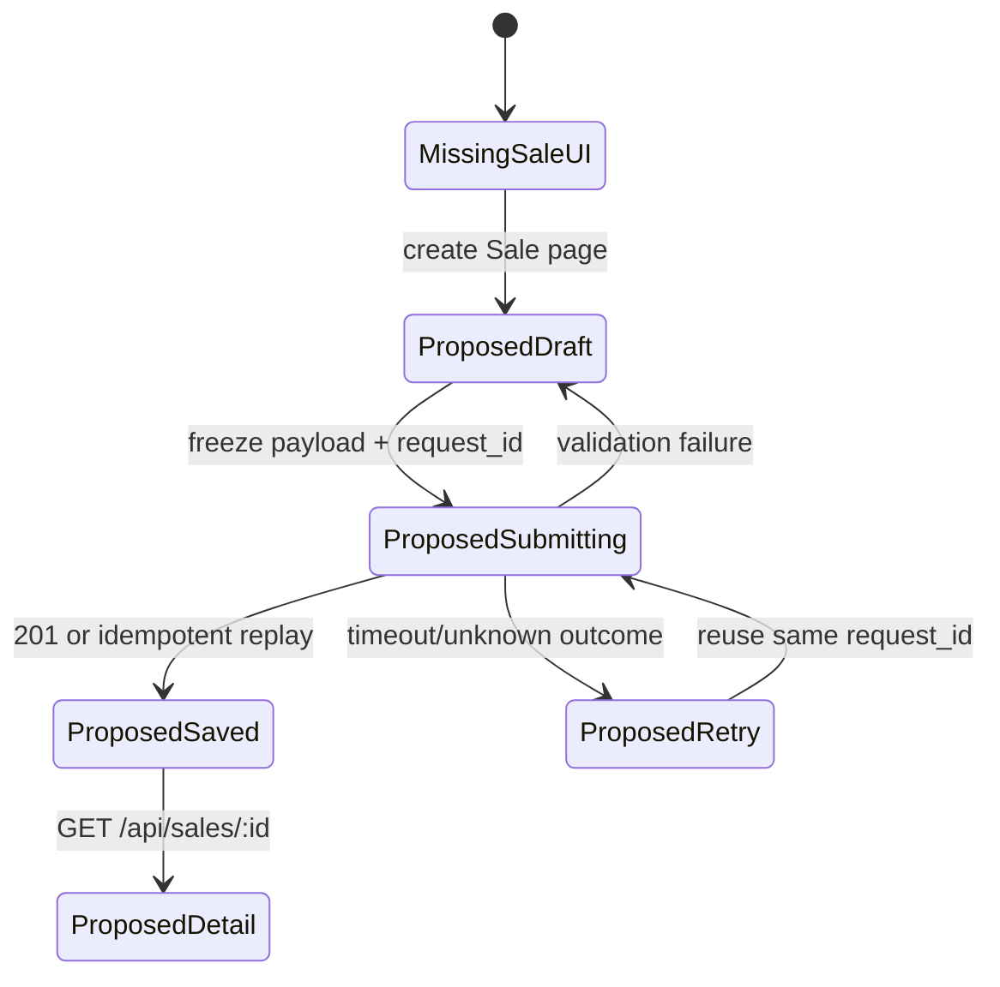
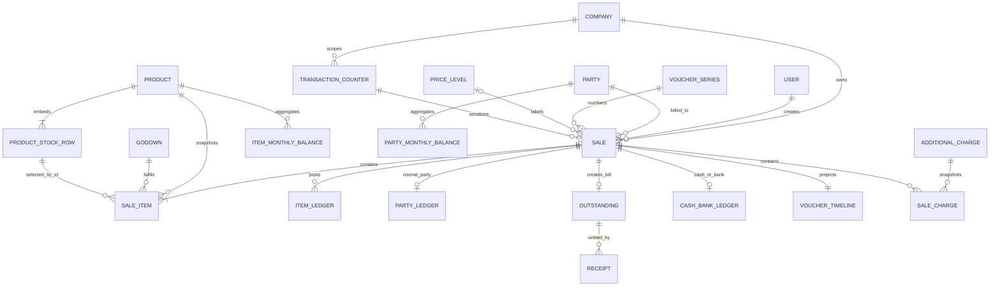
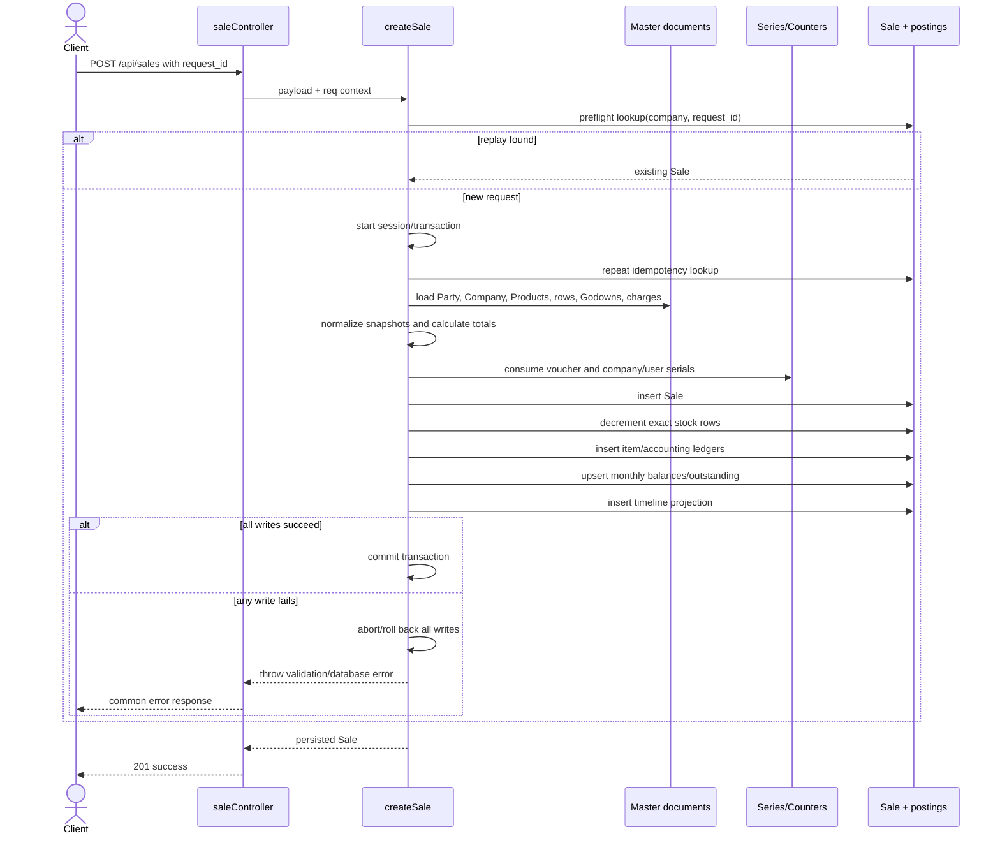

# Sale Flow Technical Handover Report

> Source-of-truth snapshot: current repository worktree inspected on 2026-09-16. This report describes the `Sale` implementation, not an idealized ERP design. `SaleOrder` code is mentioned only where it is adjacent or reusable and is always labelled separately.

Status labels used throughout: **[IMPLEMENTED]**, **[PARTIAL]**, **[NOT IMPLEMENTED]**, **[FRONTEND ONLY]**, **[BACKEND ONLY]**, **[TESTED]**, **[UNTESTED]**.

## 1. Executive summary — what happens when Save is pressed?

There is currently no Sale Create screen, Sale API client, Sale React Query mutation, or Sale draft in the React application. Therefore, a user cannot presently press **Save** on a Sale in the shipped frontend. The screens under `frontend/src/pages/sales/` are Sale **Order** screens and submit to `/api/sale-orders`; they do not submit to `/api/sales`. This is the most important boundary for a new implementer.

The actual Sale entry point is **[BACKEND ONLY]** `POST /api/sales`. After authentication and company-access middleware resolve the company, the controller passes the request body and authenticated request context to `backend/services/sale.service.js:263` → `createSale()`.

At a high level, `createSale()` does this:

1. Validates the company/user IDs, mandatory client `request_id`, selected party, series, date, optional price level, item inputs, and additional-charge inputs.
2. Returns an already-created Sale immediately when `(cmp_id, request_id)` already exists.
3. Starts a Mongoose session and a MongoDB transaction, then checks the idempotency key again inside that transaction.
4. Loads authoritative Company, Party, optional PriceLevel, Product, Godown, stock-row, and AdditionalCharges master records in the same session.
5. Derives tax type from the Company and Party state: equal non-empty states use `cgst_sgst`; every other case uses `igst`.
6. Recalculates every financial value on the backend. Client-supplied totals, product names, tax rates, batch, MRP, and godown name are not trusted.
7. Allocates the voucher number and company/user serial numbers inside the transaction.
8. Inserts the Sale document with party/item/master snapshots, calculated totals, `status: "active"`, and `tally_status: "pending"`.
9. Deducts `actual_qty` from the selected embedded `Product.GodownList.balance_stock` row. Repeated lines for the same product and stock-row are grouped for this one atomic `$inc`. Negative stock is deliberately allowed.
10. Inserts one `ItemLedger` OUT row per Sale item and increments `ItemMonthlyBalance.total_outward_qty` by `actual_qty`. Its transaction count is a line count, not a voucher count.
11. Branches on `Party.partyType`:
    - normal `party`: inserts one debit `PartyLedger`, increments `PartyMonthlyBalance.total_debit`, and inserts one receivable `Outstanding` row;
    - `cash` or `bank`: inserts one credit `CashBankLedger` row and deliberately does **not** create PartyLedger, PartyMonthlyBalance, or Outstanding.
12. Inserts one `VoucherTimeline` summary row used by the Daybook.
13. Commits all writes together and returns `{ success: true, data: { sale } }` with HTTP 201. Any thrown error aborts all transaction-bound writes, including voucher/counter increments.

The money/stock split is explicit: stock and item ledger use `actual_qty`; financial calculations use `billed_qty × rate`. The service assumes the submitted quantities and rate are already in base-unit form. It validates `selected_unit`, but does not convert alternate-unit input. The adjacent Sale Order UI has conversion helpers that canonicalize quantity and rate to the base unit, but that UI is not connected to Sale.

The current Sale lifecycle stops after create/read:

- **[IMPLEMENTED]** create, read-by-ID, stock posting, item/party/cash-bank ledgers, monthly totals, outstanding creation, timeline, idempotency, development audit/reset utilities;
- **[NOT IMPLEMENTED]** Sale update/edit route and service;
- **[NOT IMPLEMENTED]** Sale cancellation route and reversal service, despite schema fields and a lifecycle configuration entry;
- **[NOT IMPLEMENTED]** Sale Tally export, acknowledgement, or status transition;
- **[NOT IMPLEMENTED]** Sale-specific React create/detail UI, Sale printing, thermal printing, or Sale-specific list screen.

Consequently, another project should reproduce the backend create transaction first, then build a new Sale client that performs base-unit conversion, creates and persists a stable `request_id` across retries, captures a stock-row ID, and uses the backend response rather than assuming the previewed voucher number was consumed.

Primary implementation references:

- `backend/routes/sale/saleRoute.js:9-15` → HTTP routes.
- `backend/controllers/saleController.js:9-39` → response/error mapping.
- `backend/services/sale.service.js:263-497` → complete posting transaction.
- `backend/services/saleFoundation.service.js:91-399` → normalization, master resolution, tax and totals.
- `backend/Model/Sale.js:18-160` → persisted contract and indexes.
- `backend/tests/sale/` and `backend/tests/saleFoundation.test.js` → executable business-rule evidence.

## 2. Scope, repository analysis, and real implementation boundary

The analysis searched Sale/Sale Order, ledgers, monthly balances, outstanding, stock/godown/batch, idempotency, voucher identity, Tally, Daybook, detail, print/PDF, frontend state, services, routes, models, development utilities, and tests.

### What is actually a Sale

| Layer | Current Sale implementation | Status |
|---|---|---|
| Model | `backend/Model/Sale.js` | **[IMPLEMENTED]** |
| Create API | `POST /api/sales` | **[IMPLEMENTED] [BACKEND ONLY]** |
| Detail API | `GET /api/sales/:id` | **[IMPLEMENTED] [BACKEND ONLY]** |
| Audit API | `GET /api/sales/:saleId/audit`, development only | **[IMPLEMENTED] [BACKEND ONLY]** |
| Edit API | No `PUT/PATCH /api/sales/:id` | **[NOT IMPLEMENTED]** |
| Cancel API | No `/api/sales/:id/cancel` | **[NOT IMPLEMENTED]** |
| Frontend create/API hook | No Sale service/hook/page | **[NOT IMPLEMENTED]** |
| Frontend detail | Generic placeholder for `voucherType === "sale"` | **[PARTIAL]** |
| Daybook | Backend timeline can return Sale; frontend filter options omit Sale | **[PARTIAL]** |
| Sale printing | No Sale renderer or PDF | **[NOT IMPLEMENTED]** |
| Tally Sale sync | No Sale export/acknowledgement route | **[NOT IMPLEMENTED]** |

### Sale Order is a separate subsystem

`SaleOrderCreatePage`, `ProductSelectPage`, Sale Order Redux reducers, Sale Order edit/cancel, LSP lookup, Sale Order Tally conversion, and `generateSaleOrderPdf()` operate on `SaleOrder` and `/api/sale-orders`. They do not create `Sale`, deduct stock, or post Sale ledgers. They are documented here only to prevent accidental reuse claims and to identify potentially reusable frontend algorithms.

### Company and creator scope

`backend/routes/sale/saleRoute.js:9-10` applies `protect` and `requireCompanyAccess`. `requireCompanyAccess` places the authorized company into `req.companyId`; create ignores a body-supplied company ID. `getSaleById()` also calls `applyTransactionCreatorScope()`, so a staff user is limited to records whose `created_by` equals that staff user, while an admin remains company-scoped.

## 3. High-level architecture



The authoritative orchestration is one service rather than a separate stock/accounting domain-service graph. Helper functions in `sale.service.js` perform stock and monthly updates directly.

## 4. Real entry points and call chain

### HTTP entry points

| Entry | File/function | Input | Output | Next call |
|---|---|---|---|---|
| `POST /api/sales` | `backend/routes/sale/saleRoute.js:9` | JSON body; authenticated company/user | Route dispatch | `saleController.createSale()` |
| Create controller | `backend/controllers/saleController.js:9-16` | `req.body`, `req` | HTTP 201 `{success,data:{sale}}` or error JSON | `sale.service.createSale()` |
| `GET /api/sales/:id` | `backend/routes/sale/saleRoute.js:10` | Sale ID; company context | Persisted Sale, unpopulated | `saleController.getSaleById()` → service |
| Development audit | `backend/routes/sale/saleRoute.js:12-15` | Sale ID; development environment only | Cross-collection diagnostic | `saleAudit.service.auditSale()` |
| Development reset | `POST /api/dev/reset-sales` | Confirmation string, optional dry run | Destructive company-wide reset summary | `saleReset.service.resetSaleTransactions()` |

There is no dedicated Sale list endpoint. Daybook listing enters through `GET /api/vouchers`, which reads `VoucherTimeline` rather than Sale directly.

### Frontend entry points

**Not currently implemented.** No frontend code calls `/sales`, generates `request_id`, selects a Sale stock row, or handles a Sale create response. `frontend/src/pages/sales/SaleOrderCreatePage.jsx` is a Sale Order entry point and must not be documented as Sale create.

## 5. Complete Sale create flow

### 5.1 Request prerequisites and example payload

The backend accepts camelCase or selected snake_case aliases for core fields. A representative payload supported by the current service is:

```json
{
  "request_id": "client-stable-uuid-or-key",
  "selectedSeries": { "_id": "<embedded VoucherSeries.series _id>" },
  "transactionDate": "2026-07-15",
  "partyId": "<Party _id>",
  "priceLevelId": "<optional PriceLevel _id>",
  "items": [
    {
      "itemId": "<Product _id>",
      "godownId": "<Godown _id>",
      "godownStockRowId": "<Product.GodownList row _id>",
      "selectedUnit": "NOS",
      "actualQty": 3,
      "billedQty": 2,
      "rate": 100,
      "taxInclusive": false,
      "discountType": "percentage",
      "discountValue": 5,
      "initialPriceSource": "manual",
      "description": "optional"
    }
  ],
  "additionalCharges": [
    {
      "additionalChargeId": "<AdditionalCharges _id>",
      "action": "add",
      "value": 50
    }
  ],
  "despatchDetails": {
    "challanNo": "CH-1",
    "vehicleNo": "KL-00-AA-0000"
  },
  "narration": "optional"
}
```

Client totals, tax rates, product/godown/batch names, MRP, and party snapshots are neither required nor trusted by `createSale()`.

### 5.2 Pre-transaction normalization

`backend/services/sale.service.js:263-284`:

- takes `cmp_id` from `req.companyId` and user ID from `req.user`;
- requires `request_id` to be a trimmed string of 1–128 characters;
- checks for an existing `(cmp_id, request_id)` and returns it immediately;
- validates Party, embedded series, optional PriceLevel ObjectIds, and date;
- delegates item/charge boundary validation to `normalizeSaleInput()`.

`backend/services/saleFoundation.service.js:91-197` requires at least one item, validates ObjectIds and text, allows finite non-negative `actualQty`, `billedQty`, `rate`, and charge value, limits percentage discount to 100, requires a Boolean `taxInclusive`, and requires charge action `add` or `subtract`. It does not require quantity or rate to be greater than zero.

### 5.3 Transaction start and second idempotency check

`mongoose.startSession()` and `session.withTransaction()` begin at `sale.service.js:284-288`. Lines 291-297 recheck the idempotency key in-session, closing the race between the first lookup and transaction start.

### 5.4 Authoritative master resolution

Inside the transaction, the service loads Company, company-owned Party, and optional company-owned PriceLevel. It then resolves each item and charge:

- Product must belong to the company.
- Godown must belong to the company.
- `godown_stock_row_id` must be an embedded row on that Product.
- The embedded row's `godown` must equal the submitted `godown_id`.
- `selected_unit` must equal the Product `base_unit` or `alt_unit`.
- Product name, HSN, unit conversion metadata, stock-row batch/dates/MRP, and GST/cess rates are copied from masters.
- Additional charge name, HSN, and GST rates are copied from the AdditionalCharges master.

References: `sale.service.js:299-325`; `saleFoundation.service.js:200-288`.

### 5.5 Tax regime and backend-authoritative calculation

`sale.service.js:327-335` derives tax type and calls `calculateSaleTotals()`. The calculation is detailed in sections 15 and 26. The service ignores any frontend total fields. This is the primary mismatch-protection mechanism.

### 5.6 Voucher identity allocation

`sale.service.js:336-343` calls `issueVoucherIdentity()` with voucher series type `"sales"` and transaction counter type `"sale"`. Voucher series and both serial counters are changed inside the same transaction as the Sale.

### 5.7 Sale insert and snapshots

`Sale.create()` at `sale.service.js:345-386` persists:

- identity and voucher values;
- the Party reference plus name/GST/address/mobile/state snapshot;
- tax type and optional document-level price level snapshot;
- product/godown/batch/unit/tax/amount snapshots for every item;
- calculated additional-charge snapshots and totals;
- despatch/narration;
- initial active/pending statuses and creator/updater.

`mailing_name` is currently forced to `party.partyName`; a body mailing name is not used by Sale create.

### 5.8 Stock and inventory accounting

`decrementStock()` groups item `actual_qty` by `item_id + godown_stock_row_id` and uses atomic `$inc: { balance_stock: -quantity }`. A missing embedded row causes a validation error and transaction rollback. There is no balance sufficiency predicate; negative stock is allowed.

One ItemLedger OUT row is then inserted per Sale item, followed by per-product monthly outward increments. See sections 8–10.

### 5.9 Financial posting branch

`isCashBankParty()` checks only normalized `Party.partyType`:

- `cash` or `bank`: one CashBankLedger credit for final amount;
- anything else permitted by Party schema (`party`): one PartyLedger debit, one PartyMonthlyBalance debit increment, and one Outstanding debit bill.

This branch is at `sale.service.js:413-478`.

### 5.10 Timeline, commit, response, rollback

`sale.service.js:479-483` creates one VoucherTimeline summary row. When the callback completes, MongoDB commits all writes. If any operation throws, `withTransaction()` aborts the transaction. The controller returns HTTP 201 even for an idempotent replay.

There is no frontend success flow for Sale. Therefore draft clearing, success toast, cache seeding, and navigation to Sale Detail are **Not currently implemented**. Those behaviors exist only for Sale Order.

## 6. Sale document/database model

The model is `backend/Model/Sale.js:18-160`.

### Identity and tenancy

| Field | Meaning / why it exists |
|---|---|
| `_id` | Mongo document identity; referenced by all posting rows. |
| `cmp_id` | Company/tenant scope. |
| `request_id` | Client idempotency key, unique only within a company. |
| `created_by`, `updated_by` | User references; also used for staff read scope. |
| `created_at`, `updated_at` | Mongoose timestamps. |

### Voucher identity

| Field | Meaning |
|---|---|
| `voucher_type` | Stored as `sale`. |
| `series_id`, `series_name` | Embedded series identity and name snapshot. |
| `voucher_number` | Formatted prefix/number/suffix string. |
| `current_series_number` | Numeric series value consumed for this Sale. |
| `company_level_serial_number` | Monotonic counter scoped to company + transaction type. |
| `user_level_serial_number` | Monotonic counter scoped to company + transaction type + user. |
| `date` | Transaction date. |

Unique indexes protect company voucher number, company serial, and company/user serial.

### Party and pricing context

| Field | Reference vs snapshot |
|---|---|
| `party_id` | Live Party reference for relationships and accounting. |
| `party_snapshot` | Immutable-at-create name, GST, billing/shipping address, mobile, state for historical rendering. |
| `mailing_name` | Snapshot, but current create always uses Party name. |
| `tax_type` | Calculated document regime: `igst` or `cgst_sgst`. |
| `price_level_id` | Optional validated live reference. |
| `price_level_name` | Name snapshot. The price level does not calculate the rate on the backend. |

### Item snapshot

Each embedded item has its own `_id`, enabling `ItemLedger.voucher_item_id` to point to a specific line.

| Group | Actual fields |
|---|---|
| Product | `item_id`, `item_name`, `hsn` |
| Units | `base_unit`, `selected_unit`, `alternate_unit`, `base_denominator`, `alt_conversion` |
| Quantities | `actual_qty`, `billed_qty`, `alternate_actual_qty`, `alternate_billed_qty` |
| Stock location | `godown_id`, `godown_name`, `godown_stock_row_id`, `batch`, `mfgdt`, `expdt`, `mrp` |
| Pricing | `price_level_id`, `rate`, `initial_price_source` |
| Discount | `discount_type`, `discount_percentage`, `discount_amount` |
| Tax | `tax_rate`, `cess_rate`, `addl_cess_rate`, `tax_inclusive`; IGST/CGST/SGST/tax/cess/additional-cess amounts |
| Amounts | `base_price`, `taxable_amount`, `total_amount` |
| Other | `description`, `warranty_card_id` |

Important implementation gaps inside this schema:

- `mapSaleItems()` does not copy `alternate_actual_qty` or `alternate_billed_qty`, so newly created Sales leave those schema fields null.
- `mapSaleItems()` does not copy per-line `price_level_id`, so the item field remains null even if the Sale has a document-level PriceLevel.

### Totals and additional sections

`totals` uses the shared `TotalsSchema`: subtotal, discounts, taxable, GST splits, cess, item total, signed additional-charge totals/taxes, amount-with-charges, round-off, and final amount. Round-off is always 0 in current Sale calculation. Additional charges embed their master ID and calculation snapshot. Despatch details embed challan/container/carrier/destination/vehicle/order/payment/delivery terms.

### Lifecycle

`status` enum is `active|cancelled`; `tally_status` enum is `pending|accepted`. Cancellation metadata exists, but no Sale cancellation operation writes it. No `rejected` or `synced` Sale status exists.

## 7. Item quantity and unit architecture

### Canonical backend behavior

The Sale backend does not perform unit conversion. It only verifies that `selected_unit` equals the Product's base or alternate unit. It then treats:

- submitted `actual_qty` as the stock/base ledger quantity;
- submitted `billed_qty` as the financial quantity;
- submitted `rate` as the rate multiplied by `billed_qty`.

Therefore the effective contract is that the caller must submit base-unit canonical quantities and a base-unit rate, even when `selected_unit` records that the user entered an alternate unit. This contract is inferred from direct usage, not from an explicit Sale API validator or frontend.

### Adjacent Sale Order conversion code

The only implemented conversion helpers live in the Sale Order frontend:

```text
baseDenominator base units = altConversion alternate units
alternateQty = baseQty × altConversion / baseDenominator
baseQty      = alternateQty × baseDenominator / altConversion
alternateRate = baseRate × baseDenominator / altConversion
baseRate      = alternateRate × altConversion / baseDenominator
```

References: `frontend/src/utils/unitConversion.js:12-67` and `frontend/src/utils/saleOrderUnitDraft.js:35-197`.

### Worked example: 20 NOS = 1 BOX

Use `base_unit=NOS`, `alternate_unit=BOX`, `base_denominator=20`, `alt_conversion=1`.

If the user enters actual `2 BOX`, billed `3 BOX`, and rate `₹200/BOX`, the adjacent helper produces:

- `actual_qty = 2 × 20 / 1 = 40 NOS`;
- `billed_qty = 3 × 20 / 1 = 60 NOS`;
- base `rate = 200 × 1 / 20 = ₹10/NOS`;
- stock movement = 40 NOS;
- gross financial value = 60 × ₹10 = ₹600.

A future Sale frontend must send those canonical values. If it instead sends `actualQty:2`, `billedQty:3`, `rate:200`, the current backend will incorrectly (relative to the UI intention) deduct 2 and bill ₹600 without any conversion. This is a contract risk, not an implemented conversion path.

### Persistence and display

Base and selected unit plus conversion metadata persist. Base quantities persist. Alternate quantities are defined in the Sale schema but not mapped on create. No Sale display/print layer currently exists, and no quantity is sent to Tally because Sale Tally export is not implemented.

### Edit hydration

**Not currently implemented for Sale.** Sale Order hydration exists in `transactionSlice.js:220-279`, but it is not wired to the Sale model and should not be considered Sale behavior.

## 8. Stock flow

Stock is stored on the Product document in embedded `GodownList` rows (`backend/Model/ProductSchema.js:51-89,166-168`). The current Sale does not change `Product.saleable_stock`.



Rules implemented by `resolveSaleItemMaster()` and `decrementStock()`:

- A stock row is identified by company Product `_id` plus embedded row `_id`; godown and batch are not used as the update key.
- Godown is independently validated and must match the row's `godown` reference.
- Batch/MRP/manufacturing/expiry are authoritative snapshots from that row.
- Multiple lines sharing product + stock-row are summed for one Product `$inc`.
- ItemLedger remains one row per Sale line.
- Negative stock is intentionally allowed; there is no `$gte` guard.
- `$inc` prevents lost updates between concurrent sellers. Two concurrent Sales both deduct, even if the result is negative.
- If the row disappeared between resolution and update, `matchedCount !== 1` throws and rolls back.

Create behavior is **[TESTED]** in `sale.stockPolicy.test.js:90-138`. Edit reversal/reapplication and cancellation restoration are **Not currently implemented**.

## 9. ItemLedger

`backend/Model/ItemLedger.js` stores company, product, godown, exact embedded stock-row ID, batch, voucher identity, Sale line ID, date, base quantity/unit, movement, lifecycle/Tally status, and creator.

For each Sale line, `sale.service.js:391-411` writes:

- `voucher_type: "sale"`;
- `voucher_id: Sale._id`;
- `voucher_item_id: Sale.items[n]._id`;
- `base_quantity: item.actual_qty`;
- `movement_type: "OUT"`;
- `status: "active"`, `tally_status: "pending"`.

`OUT` means stock left inventory. The model stores positive quantity; direction is represented by `movement_type`, not a negative number.

| Event | Current behavior |
|---|---|
| Create | One OUT ledger per Sale item. **[IMPLEMENTED]** |
| Edit | Not currently implemented. |
| Cancel | Not currently implemented; rows are never marked cancelled by a Sale service. |
| Tally acceptance | Not currently implemented; rows remain pending unless changed outside this flow. |

The model has useful indexes but no unique index preventing duplicate voucher-item ledger rows. Sale idempotency and transaction orchestration are the duplicate-write protection.

## 10. ItemMonthlyBalance

Unique key: `(cmp_id, item_id, month_key)`. `month_key` is formatted as local-time `YYYY-MM` by `sale.service.js:78-80`.

Fields are `total_inward_qty`, `total_outward_qty`, `accepted_inward_qty`, `accepted_outward_qty`, and `transaction_count`.

On create, Sale groups its lines by Product and performs:

```text
total_outward_qty += Σ line.actual_qty for that product
transaction_count += number of Sale lines for that product
```

It does not bucket by godown or batch. Inward and accepted fields are unchanged. Because `$inc` plus unique upsert is used inside the transaction, updates are atomic; concurrent first-time upserts may conflict and rely on transaction/unique-index behavior.

Edit, cancellation, and Tally-accept adjustments are **Not currently implemented**. `saleReset.service.js` can rebuild accepted totals from existing ledger statuses during a development reset, but that is not a Tally acceptance workflow.

## 11. Party accounting flow

For a normal Party (`partyType: "party"`), the Sale writes one positive PartyLedger amount with `ledger_side: "debit"`. The application does not create a balancing revenue/tax ledger entry; this is a party-control ledger only.

Fields and semantics:

- `voucher_type="sale"`, `voucher_id=Sale._id`, and voucher number/date link the posting;
- Party reference and name snapshot identify the account;
- `amount=Sale.totals.final_amount` is always stored positive;
- `ledger_side="debit"` supplies direction;
- `against_id=null` because the Sale has no separate Party/head in this model;
- status/Tally status mirror Sale initial values.

The create transaction then increments the party monthly debit and creates a debit Outstanding bill. This exact path is asserted in `sale.service.test.js:117-181,411-417`.

## 12. PartyMonthlyBalance

Unique key: `(cmp_id, party_id, month_key)`.

On a normal Sale:

```text
total_debit      += Sale.totals.final_amount
total_credit     += 0
transaction_count += 1
accepted_debit/accepted_credit unchanged
```

Cash/bank Sales do not create this row. Receipt creation separately increments `total_credit`, and receipt cancellation reverses that credit. There is no Sale edit/cancel/Tally-accept adjustment.

No Account Statement read service using PartyMonthlyBalance was found. In the current repository these summaries support posting integrity/audit and dependency checks, while Outstanding powers customer balances. Therefore any claim that the Sale summary directly drives an Account Statement would be unsupported.

## 13. Outstanding architecture

Only normal-party Sales create Outstanding. The Sale row contains:

- company/owner and Party/account-group links;
- Party name/contact snapshots;
- `billId=String(Sale._id)`, `source="sale"`, voucher number/date;
- `bill_amount=final_amount`;
- `bill_pending_amt=final_amount`;
- `classification="dr"`, `isCancelled=false`;
- due date equal to Sale date. Party credit period is not applied.

Outstanding has no separate `received_amount` field. Receipt allocation uses `CashTransaction.settlement_details` and mutates the outstanding:

```text
new bill_pending_amt = current bill_pending_amt - settled_amount
```

It validates `0 < settled_amount <= current pending`. Full settlement leaves a row with pending 0; it is not deleted. Receipt cancellation adds each settled amount back. Thus, while active allocations are consistent, the stored formula is incremental rather than recalculated on every read. The audit service reports `adjustedAmount = bill_amount - bill_pending_amt`.

Sale edit/cancel handling of Outstanding is **Not currently implemented**. Cash/bank Sales deliberately create no Outstanding.

## 14. Cash / Bank Sale

`sale.service.js:94-99` treats a Party as cash/bank only when `partyType`, trimmed and lowercased, is exactly `cash` or `bank`.

| Operation | Normal Party Sale | Cash/Bank Sale |
|---|---|---|
| Sale document | Created | Created |
| Product stock | `actual_qty` deducted | Same |
| ItemLedger | OUT per line | Same |
| ItemMonthlyBalance | Outward increment | Same |
| PartyLedger | One debit | None |
| PartyMonthlyBalance | Debit increment | None |
| Outstanding | One receivable bill | None |
| CashBankLedger | None | One credit for final amount |
| VoucherTimeline | One active row | Same |

CashBankLedger stores the selected Party as both `cash_bank_id` and `party_id`, uses `cash_bank_type` from Party, `instrument_type="cash"` for cash and `"neft"` for bank, and mirrors status/Tally status. Its schema declares `voucher_id` with `ref: "CashTransaction"`, but Sale stores a Sale `_id`; this is a polymorphic-reference mismatch to be aware of.

Cash and bank branches are **[TESTED]**. `backend/utils/repairCashBankSales.js` is a one-time/idempotent repair utility for legacy cash/bank Sales that were incorrectly posted as customer receivables; it is not part of normal create.

## 15. Tax architecture

### Regime selection

`company.state` and `party.state` are trimmed and lowercased. Equal, non-empty values yield `cgst_sgst`; otherwise the Sale uses `igst`. Missing state therefore defaults to inter-state treatment.

### Item formulas

For each line:

```text
gross = billed_qty × rate
gstRate = IGST rate, or CGST rate + SGST rate

base_price = tax_inclusive and gstRate > 0
  ? gross / (1 + gstRate/100)
  : gross

discount_amount = percentage
  ? base_price × discount_value/100
  : discount_value

taxable_amount = base_price - discount_amount
IGST or CGST/SGST = taxable_amount × applicable master rates
cess_amount = taxable_amount × cess_rate/100
addl_cess_amount = billed_qty × addl_cess_rate
total_amount = round2(taxable + GST + cess + additional cess)
```

Tax-inclusive removal strips GST only; cess is added afterward. Percentage or amount discount is applied after removing included GST. Discount cannot exceed base price.

Line GST/cess values are calculated at full JavaScript precision and line `total_amount` is rounded to two decimals. Document totals sum fields and round each sum to two decimals. Additional-charge GST is rounded to two decimals before applying the add/subtract sign.

Example: inclusive ₹100 at 18% with ₹10 amount discount produces base `100/1.18`, taxable `100/1.18 - 10`, GST on that taxable value, and total ₹88.20. This behavior is **[TESTED]** in `saleFoundation.test.js:23-55`.

## 16. Price level and last selling price

### Sale backend

The optional `priceLevelId` is validated against company ownership and its ID/name are snapshotted on Sale. It does **not** choose, validate, or recalculate item rate. The caller's `rate` is accepted after finite/non-negative validation.

Per-item `price_level_id` exists in the schema but is not mapped during Sale create. `initial_price_source` is persisted if supplied, without enum validation.

### Adjacent Sale Order frontend

Sale Order ProductSelect implements initial-rate priority:

1. selected Product price-level rate;
2. party-specific LSP;
3. global LSP;
4. manual zero.

Changing price level with staged rows requires confirmation and reprices every staged row; a missing new-level rate becomes zero. Party change recalculates tax, but does not automatically refetch/reprice items already in the cart.

The LSP backend queries **SaleOrder only**, not Sale (`backend/services/pricing.service.js:15-94`). There is no `LastSellingPrice` collection. A Sale create does not update LSP. Therefore Sale-specific LSP is **Not currently implemented**.

## 17. Idempotency

### Implemented backend contract

- key: trimmed `request_id`, maximum 128 characters;
- scope: company + request ID;
- storage: Sale document;
- database guard: unique partial index `{cmp_id:1, request_id:1}`;
- checks: before transaction and again inside transaction;
- final race guard: duplicate-key detection after rollback, followed by lookup/return of the winner.

The same key with a different payload returns the original Sale; no payload hash comparison is performed.

```mermaid
sequenceDiagram
    participant A as Request A
    participant B as Request B
    participant S as createSale
    participant DB as MongoDB
    A->>S: cmp + request_id K
    B->>S: cmp + request_id K
    S->>DB: pre-check K (both may miss)
    A->>DB: transaction + insert Sale K
    B->>DB: transaction + insert Sale K
    DB-->>A: commit winner
    DB-->>B: unique/write conflict; rollback all B writes
    B->>DB: find committed Sale K
    DB-->>B: same Sale as A
```

This prevents duplicate stock, ledger, monthly, outstanding, timeline, and voucher writes because all losing-request effects are transaction-bound.

### Frontend state and retry

**Not currently implemented.** No Sale frontend creates or stores a UUID/request ID. No Sale React Query mutation exists. The repository-level QueryClient has no explicit retry configuration (`frontend/src/main.jsx:14`). A new frontend must retain one key for the logical draft and reuse it after timeout/retry, changing it only when starting a genuinely new Sale.

Idempotency is **[TESTED]** for index existence, sequential replay, concurrent replay, different keys, company scoping, and invalid keys.

## 18. Voucher numbering

The selected series is an embedded row in a company/voucher-type `VoucherSeries` document. Sale passes voucher type `sales`.

`getNextVoucherNumber()`:

1. loads the embedded series by company, `voucherType="sales"`, and series `_id`;
2. reads `currentNumber` and pads it to `widthOfNumericalPart`;
3. formats prefix/number/suffix with `" / "` separators;
4. atomically sets `lastUsedNumber=currentNumber` and increments `currentNumber` by 1;
5. returns the consumed number and updated series.

In parallel, TransactionCounter atomically increments company and user sequences under transaction type `sale`. Unique indexes exist on the counter scope and Sale serial fields.

A number is consumed inside the create transaction immediately before Sale insert. If any later posting fails, the series increment and counters roll back with the transaction. Financial year is not represented in this logic. Deleting/resetting Sales does not reset VoucherSeries or TransactionCounter; the development reset service intentionally leaves numbering untouched.

## 19. Transaction boundaries and failure semantics

All normal Sale create writes below are in the single `withTransaction()` started by `createSale()`.

| Operation | In transaction? | Collection/model | Failure behavior |
|---|---:|---|---|
| Idempotency in-session check | Yes | Sale | Existing document short-circuits callback |
| Master reads | Yes | Company, Party, PriceLevel, Product, Godown, AdditionalCharges | Validation error aborts |
| Voucher increment | Yes | VoucherSeries | Rolled back |
| Company/user serials | Yes | TransactionCounter | Rolled back |
| Sale document | Yes | Sale | Rolled back |
| Stock deduction | Yes | Product | Rolled back |
| Item ledger | Yes | ItemLedger | Rolled back |
| Item monthly totals | Yes | ItemMonthlyBalance | Rolled back |
| Party ledger | Yes, normal party only | PartyLedger | Rolled back |
| Party monthly totals | Yes, normal party only | PartyMonthlyBalance | Rolled back |
| Outstanding | Yes, normal party only | Outstanding | Rolled back |
| Cash/bank ledger | Yes, cash/bank only | CashBankLedger | Rolled back |
| Timeline | Yes | VoucherTimeline | Rolled back |

If an error occurs halfway through, the transaction aborts and none of these writes should remain. The service always ends the session. Deployment must support MongoDB transactions (replica set or sharded transaction-capable topology).

The initial pre-transaction idempotency read and the final post-error replay lookup are deliberately outside the transaction and are read-only.

## 20. Sale edit flow

**Not currently implemented.** There is no Sale PUT/PATCH route, controller, service, frontend edit page, or mutation. `transactionState.service.js` explicitly defines `sale.editableStatuses: []`.

Consequences:

- existing Sale fetch/hydration into editable state: not implemented;
- quantity/unit/rate/godown/batch changes: not implemented;
- old stock reversal and new stock reapplication: not implemented;
- ItemLedger replacement/delta posting: not implemented;
- ItemMonthlyBalance and PartyMonthlyBalance deltas: not implemented;
- Outstanding recalculation and allocation conflict handling: not implemented;
- switching normal party ↔ cash/bank: not implemented;
- transaction and audit timeline update: not implemented.

Tally-accepted Sales cannot be edited, but only because no Sale can be edited at all—not because an accepted-status guard was implemented. Sale Order edit code must not be mistaken for Sale edit.

## 21. Sale cancellation flow

**Not currently implemented.** The Sale schema contains `status: active|cancelled`, `cancelled_at`, and `cancelled_by`, and transaction-state configuration lists an active Sale as cancellable. Those declarations do not constitute an operational cancellation path: there is no Sale cancellation route, controller, service, or frontend action.

A correct cancellation must be a single transaction that locks/re-reads the active Sale, rejects a replayed cancellation, restores each exact Product `GodownList` row by base `actual_qty`, writes reversal ItemLedger entries, reverses ItemMonthlyBalance quantities/counts, reverses either the party or cash/bank accounting branch, resolves or blocks Outstanding allocations, marks the Sale cancelled, and updates its timeline projection. This must be designed before enabling the schema flag. The receipt cancellation implementation is useful evidence for outstanding-allocation reversal, but it cannot be copied blindly because Sale owns the bill rather than the settlement.

## 22. Tally export and acceptance

**Not currently implemented for Sale.** New Sales and all of their ledgers are written with `tally_status="pending"`; the schemas also permit `accepted`. No Sale exporter, acknowledgement endpoint, accepted-status transition, retry state, rejection state, or sync log was found.

The repository's Tally conversion/export flow targets **Sale Orders**, not Sales. Accordingly:

- no current process changes a Sale or its ledgers to accepted;
- accepted columns in monthly balances are not updated by the live Sale flow;
- no Tally lock is enforcing immutability;
- no Sale XML/JSON mapping can be inferred safely from the Sale Order exporter.

A future integration needs an explicit export contract, deterministic external key, acknowledgement state machine, atomic status propagation to the Sale and dependent ledgers/monthly accepted totals, and idempotent re-export behavior.

## 23. Voucher timeline, audit, and repair/reset utilities

`VoucherTimeline` is a **one-row current summary projection**, not an append-only audit event stream. Its unique key is voucher type plus voucher ID. Sale create writes one summary containing the voucher identity, date, party, amount, status, tally status, creator, and timestamps. No Sale edit, cancel, or Tally event exists to append or update.

`GET /api/sales/:saleId/audit` is registered only in development. The audit service cross-checks the Sale against ItemLedger, ItemMonthlyBalance, PartyLedger, PartyMonthlyBalance, Outstanding or CashBankLedger, VoucherTimeline, and current referenced stock rows. It is diagnostic: current stock is shared mutable state, so it cannot prove the exact historical stock movement in isolation.

The Sale reset/repair service is also a development utility, not business cancellation. It deletes Sale-related operational documents, rebuilds monthly balances, and sets all company Product godown-row balances to the hard-coded value `100`. It does not reset voucher series or serial counters. It must never be exposed as a production reversal mechanism.

## 24. Frontend state management and hydration

There is no Sale draft slice, form, query, mutation, detail implementation, or hydration path in the frontend. The code under `frontend/src/pages/sales/` is named for the menu area but implements **Sale Order** behavior against `/api/sale-orders`.

The adjacent Sale Order state pattern is Redux-backed: header/customer state, staged line items, charges, totals, and editing identity are held in `transactionSlice`; API data is mapped into that state for editing; React Query performs remote fetch/mutation. This is a reference pattern only and is not proof of Sale behavior.



Implementation must keep canonical base quantities/rates in state, preserve the logical `request_id` across uncertain retries, and distinguish a server-returned replay from a new transaction. Existing Sale Order edit/reset actions should be generalized deliberately rather than relabelled.

## 25. Product, godown, stock-row, and batch selection

The Sale backend expects every line to identify all three authoritative references:

- `item_id`: Product document;
- `godown_id`: Godown document;
- `godown_stock_row_id`: exact embedded Product `GodownList` row.

It verifies that the Product and Godown belong to the request company, the embedded row belongs to that Product, and the row's godown matches `godown_id`. Batch number, manufacture/expiry dates, MRP, unit configuration, HSN, and tax rates are copied from the resolved Product/row—not trusted from the request.

No Sale product-selection UI currently supplies this contract. The adjacent Sale Order selector does not establish a Sale implementation and cannot cover exact stock-row/batch choice without enhancement. A future selector should key lines by stock-row identity, not merely Product ID, so two batches/godowns of one Product remain distinct.

## 26. Totals calculation pipeline

For each item, the authoritative server calculation is:

1. `gross = billed_qty × rate`;
2. if tax-inclusive, remove the GST portion from gross to obtain the pre-tax base;
3. apply percentage or fixed discount to that base;
4. set `taxable_amount = base - discount`;
5. calculate IGST or CGST+SGST from taxable amount;
6. calculate percentage cess from taxable amount;
7. calculate additional cess as the flat per-billed-unit amount;
8. set line total to taxable plus taxes, rounded to two decimals.

Document item totals are sums of authoritative line fields. Charge totals are then applied by add/subtract sign. The final amount must not be negative. `round_off` is currently always zero; there is no automatic currency rounding policy beyond two-decimal helpers.

Important edge behavior: finite non-negative quantities and rates are accepted, including zero. Discount percentage cannot exceed 100; a fixed discount cannot exceed its pre-discount base. The request's calculated totals, product names, tax rates, and charge tax metadata are not authoritative.

## 27. Additional charges

Each request charge identifies an `AdditionalCharges` master and provides its value, tax-inclusive flag, and add/subtract intent. The service reloads the company-scoped master, snapshots its name/HSN/tax rates, calculates tax according to the Sale's intra/inter-state mode, and derives signed `final_value`.

Charge tax is rounded at charge-component calculation time. Charge cess is presently hard-coded to zero even if future master fields suggest otherwise. A subtractive charge reduces the final amount by its value plus tax. If aggregate subtractive charges drive the invoice below zero, creation fails and all writes roll back.

No Sale frontend charge editor exists. The Sale Order charge UI/calculator is adjacent logic and must be reconciled against this backend formula before reuse.

## 28. Sale detail flow

`GET /api/sales/:id` calls `getSaleById()` and returns the persisted Sale as a lean object. It does not populate current masters, recalculate totals, or attach ledgers, settlement allocations, audit results, or print data.

- malformed IDs return a validation error;
- a missing Sale, another company's Sale, or a Sale outside the creator scope returns not found;
- the frontend does not call this endpoint for its Sale route;
- `TransactionDetailPage` renders “Voucher Detail Coming Soon” for a Sale.

A real detail page should treat the stored snapshots as invoice history and fetch operational extras explicitly. It should not replace snapshot names/rates with today's master values.

## 29. Listing, search, filters, and daybook integration

There is no dedicated Sale list or Sale search endpoint. The only current cross-transaction visibility is `VoucherTimeline` through the voucher/daybook service. Its filters are date, voucher type, status, and creator; no Sale text search was found.

The frontend daybook exposes explicit options for Sale Order and Receipt only. When it requests `type=all`, the backend defaults include `saleOrder`, `sale`, and `receipt`, so Sale rows can appear in the all view. Selecting such a row navigates to the generic transaction detail route, where Sale remains a placeholder. This is partial, accidental discoverability rather than a complete listing flow.

## 30. Printing and document output

**Not currently implemented for Sale.** There is no Sale invoice PDF builder, print preview, thermal renderer, printer integration, or Sale print configuration. The repository contains an A4 jsPDF/autotable generator and print settings for **Sale Order** (and receipt-related output); those must not be reported as Sale printing.

A production Sale print feature should render only persisted snapshots and server totals, support cancelled/duplicate/reprint markings, decide A4 versus thermal templates explicitly, and test page breaks, long descriptions, tax summaries, batch details, and company/party address fallbacks.

## 31. Validation and error behavior

The service rejects missing company/user context, invalid or absent `request_id`, missing/foreign Party, invalid series, invalid optional PriceLevel, invalid date, empty/invalid item arrays, invalid quantities/rates/discount/tax flags, missing or inconsistent Product/Godown/stock-row references, invalid AdditionalCharges, and a negative final total.

Errors thrown within the transaction abort all effects. The controller forwards errors to common middleware; create success is always HTTP 201, including a replay that returns the pre-existing Sale. Because replay is not signalled separately, clients should compare returned identity and regard a same-key success as completion.

Security scope is company plus authenticated creator where applied. The create path never accepts company/creator identity from payload as authoritative. Detail reads are similarly scoped. Development audit/reset endpoints require special caution and environment guarding.

## 32. Concurrency, consistency, and known races

MongoDB transactions, atomic `$inc`, and unique indexes provide the main consistency controls. Tested concurrent same-key requests resolve to one Sale; concurrent different-key stock deductions both apply; downstream failure rolls back stock and ledgers.

Known limitations and assumptions:

- stock has no `balance >= requested` predicate, so overselling/negative stock is permitted by design;
- duplicate lines for one stock row are grouped for the Product decrement but retain separate ItemLedger lines;
- ItemLedger has no unique Sale-line constraint, so correctness depends on transactional/idempotent orchestration;
- monthly balance upserts depend on their unique company/entity/month indexes and transaction retry behavior;
- same idempotency key with different payload silently returns the first Sale because no payload fingerprint is stored;
- deployment must use a transaction-capable MongoDB topology;
- current-stock inspection cannot independently reconstruct historical movements.

## 33. Entity relationship diagram



`PRODUCT_STOCK_ROW` and `SALE_ITEM` are embedded subdocuments, not standalone collections. The diagram shows logical relationships. CashBankLedger's schema declares a narrower voucher reference than the Sale service actually uses; that polymorphic mismatch is technical debt.

## 34. End-to-end create sequence



## 35. Collection write matrix

| Collection/model | Create Sale | Edit Sale | Cancel Sale | Tally accept | Purpose |
|---|---|---|---|---|---|
| Sale | Insert one snapshot document | **Not currently implemented** | **Not currently implemented** | **Not currently implemented** | Voucher source document |
| Product.GodownList | `$inc balance_stock` by negative grouped `actual_qty` | **Not currently implemented** | **Not currently implemented** | No current write | Live stock row |
| ItemLedger | Insert one OUT row per Sale line | **Not currently implemented** | **Not currently implemented** | **Not currently implemented** | Inventory movement journal |
| ItemMonthlyBalance | Increment outward quantity and line count | **Not currently implemented** | **Not currently implemented** | **Not currently implemented** | Product/month aggregate |
| PartyLedger | Insert one debit for normal party | **Not currently implemented** | **Not currently implemented** | **Not currently implemented** | Party accounting journal |
| PartyMonthlyBalance | Increment debit and transaction count for normal party | **Not currently implemented** | **Not currently implemented** | **Not currently implemented** | Party/month aggregate |
| Outstanding | Insert bill with pending equal to final amount for normal party | **Not currently implemented** | **Not currently implemented** | No current write | Receivable bill state |
| CashBankLedger | Insert one credit for cash/bank party | **Not currently implemented** | **Not currently implemented** | **Not currently implemented** | Cash/bank journal |
| VoucherTimeline | Insert one current-summary row | **Not currently implemented** | **Not currently implemented** | **Not currently implemented** | Daybook projection |
| VoucherSeries | Increment selected embedded series | No route | No reversal | No write | Human voucher numbering |
| TransactionCounter | Increment company and user Sale scopes | No route | No reversal | No write | Internal serial numbering |

Create branching details:

| Operation | Normal party | Cash party | Bank party | Quantity/sign | Initial status |
|---|---:|---:|---:|---|---|
| Sale | 1 | 1 | 1 | final amount snapshot | active / pending |
| Product.GodownList | one update per distinct row | same | same | `balance_stock -= Σ actual_qty` | n/a |
| ItemLedger | one per Sale line | same | same | OUT, positive base quantity | active / pending |
| ItemMonthlyBalance | one upsert per product/month | same | same | outward += actual; count += line count | accepted totals unchanged |
| PartyLedger | 1 debit | 0 | 0 | positive final amount | active / pending |
| PartyMonthlyBalance | 1 upsert | 0 | 0 | debit += final; count += 1 | accepted totals unchanged |
| Outstanding | 1 | 0 | 0 | bill and pending = final | active / pending |
| CashBankLedger | 0 | 1 credit | 1 credit | positive final amount | active / pending |
| VoucherTimeline | 1 | 1 | 1 | current summary | mirrors Sale |

`saleable_stock` is not changed. Outstanding due date currently equals Sale date; party credit period is not applied.

## 36. Numbered business and accounting rules

1. **SALE-RULE-001:** A Sale is company-scoped and creator-scoped.
2. **SALE-RULE-002:** Every logical create requires a non-empty 1–128 character `request_id`.
3. **SALE-RULE-003:** `(company, request_id)` identifies one immutable create result.
4. **SALE-RULE-004:** Reusing a key with changed payload still returns the first result.
5. **SALE-RULE-005:** A Sale requires at least one item.
6. **SALE-RULE-006:** Party, Product, Godown, PriceLevel, and charge masters must belong to the company.
7. **SALE-RULE-007:** The voucher series must be the selected embedded sales series.
8. **SALE-RULE-008:** Server master data overrides submitted snapshot labels and tax rates.
9. **SALE-RULE-009:** Same normalized Company/Party state means CGST+SGST; otherwise IGST.
10. **SALE-RULE-010:** Missing/unequal state therefore takes the inter-state branch.
11. **SALE-RULE-011:** Selected unit must equal the Product base or alternate unit.
12. **SALE-RULE-012:** Backend quantities and rates are already expected in base-unit canonical values.
13. **SALE-RULE-013:** Alternate-unit conversion is not performed by the Sale service.
14. **SALE-RULE-014:** `actual_qty` controls stock and item-ledger quantity.
15. **SALE-RULE-015:** `billed_qty` controls gross value and per-unit additional cess.
16. **SALE-RULE-016:** Actual and billed quantity may differ.
17. **SALE-RULE-017:** Stock is decremented from the exact embedded row ID.
18. **SALE-RULE-018:** Multiple lines on one row are grouped for one stock decrement.
19. **SALE-RULE-019:** ItemLedger remains one row per Sale line.
20. **SALE-RULE-020:** Negative stock is allowed; there is no availability rejection.
21. **SALE-RULE-021:** Product `saleable_stock` is untouched.
22. **SALE-RULE-022:** Tax-inclusive gross is de-taxed before discount.
23. **SALE-RULE-023:** Discount applies before GST/cess.
24. **SALE-RULE-024:** Percentage discount is capped at 100%.
25. **SALE-RULE-025:** Fixed discount cannot exceed its base.
26. **SALE-RULE-026:** Additional cess is flat per billed unit.
27. **SALE-RULE-027:** Charge add/subtract sign applies to value plus charge tax.
28. **SALE-RULE-028:** Final invoice value cannot be negative.
29. **SALE-RULE-029:** Normal parties create PartyLedger, PartyMonthlyBalance, and Outstanding.
30. **SALE-RULE-030:** Cash/bank parties instead create CashBankLedger.
31. **SALE-RULE-031:** A normal-party Sale is a debit to the party.
32. **SALE-RULE-032:** A cash/bank Sale is a credit in CashBankLedger.
33. **SALE-RULE-033:** Outstanding begins with pending equal to bill amount.
34. **SALE-RULE-034:** Outstanding due date currently equals voucher date.
35. **SALE-RULE-035:** All create mutations share one MongoDB transaction.
36. **SALE-RULE-036:** Any posting failure rolls back numbering, Sale, stock, and ledgers.
37. **SALE-RULE-037:** New records begin with active business status and pending Tally status.
38. **SALE-RULE-038:** VoucherTimeline is a current projection, not event history.
39. **SALE-RULE-039:** Sale edit, cancellation, Tally acceptance, and print are not operational.
40. **SALE-RULE-040:** Sale Order behavior is not evidence that the corresponding Sale feature exists.

## 37. Source-file responsibility index

| File | Important functions/constructs | Responsibility | Called by | Calls / depends on |
|---|---|---|---|---|
| `backend/app.js` | `app.use('/api/sales', ...)` | Mount Sale router | Express bootstrap | Sale router |
| `backend/routes/sale/saleRoute.js` | `router.post`, `router.get` | Create, detail, dev audit endpoints | Express app | Auth/company middleware; controller |
| `backend/controllers/saleController.js` | `createSale`, `getSaleById`, `auditSale` handlers | Translate HTTP context and response envelope | Sale router | Sale and audit services |
| `backend/services/sale.service.js` | `createSale()`, `getSaleById()`, item mapping/posting helpers | Transaction orchestration, snapshots, stock, accounting, idempotency | Sale controller | Models; foundation; voucher identity; timeline |
| `backend/services/saleFoundation.service.js` | normalization and calculation helpers | Validate/normalize input and calculate authoritative item/charge totals | Sale service; tests | Numeric/date helpers |
| `backend/Model/Sale.js` | schemas and indexes | Persist header/item/charge snapshots and lifecycle fields | Sale service | Mongoose |
| `backend/Model/Product.js` | Product and `GodownList` schemas | Units and live embedded godown/batch stock rows | Sale service | Mongoose/Godown refs |
| `backend/Model/ItemLedger.js` | ItemLedger schema | Per-line inventory movement journal | Sale service/audit | Sale/Product/Godown refs |
| `backend/Model/ItemMonthlyBalance.js` | monthly schema/index | Product/month outward aggregates | Sale service/reset/audit | Product/company refs |
| `backend/Model/PartyLedger.js` | ledger schema | Normal-party debit journal | Sale service/audit | Sale/Party refs |
| `backend/Model/PartyMonthlyBalance.js` | monthly schema/index | Party/month debit aggregates | Sale service/reset/audit | Party/company refs |
| `backend/Model/Outstanding.js` | bill/pending schema | Receivable state for normal party | Sale and receipt services | Sale/Party/allocation refs |
| `backend/Model/CashBankLedger.js` | cash/bank schema | Cash/bank Sale credit journal | Sale service/audit | Account/party/voucher refs |
| `backend/Model/VoucherTimeline.js` | timeline schema/index | Cross-voucher current summary | Timeline/voucher services | Voucher refs |
| `backend/services/voucherIdentity.service.js` | `issueVoucherIdentity()` | Coordinate series and serial issuance | Sale service | Voucher-number and counter utilities |
| `backend/utils/getNextVoucherNumber.js` | `getNextVoucherNumber()` | Format and advance embedded series atomically | Voucher identity service | VoucherSeries |
| `backend/utils/transactionCounter.js` | counter increment helpers | Issue company/user Sale serials | Voucher identity service | TransactionCounter |
| `backend/services/voucherTimeline.service.js` | timeline payload/write helper | Insert current summary projection | Sale service | VoucherTimeline |
| `backend/services/voucher.service.js` | voucher list query | Read/filter timeline for daybook | Voucher controller | VoucherTimeline |
| `backend/services/saleAudit.service.js` | Sale audit function | Dev cross-collection diagnostics | Sale controller dev route | Sale/posting models |
| `backend/services/saleReset.service.js` | reset/rebuild functions | Destructive dev reset and monthly rebuild | Dev tooling/tests | Sale/posting/Product models |
| `backend/services/receipt.service.js` | receipt create/cancel allocation logic | Adjacent evidence for Outstanding settlement behavior | Receipt controller | Outstanding/CashTransaction/ledgers |
| `frontend/src/pages/transactions/TransactionDetailPage.jsx` | voucher-type render branch | Sale detail placeholder | Frontend route | Sale Order/Receipt detail components |
| `frontend/src/pages/transactions/DayBook.jsx` | list/filter/navigation handlers | Mixed timeline UI | Frontend route | Voucher API and detail route |
| `frontend/src/constants/voucherTypes.js` | voucher options | Explicit UI filters (Sale absent) | Daybook | Static data |
| `frontend/src/pages/sales/ProductSelect.jsx` | item/rate/unit handlers | Adjacent Sale Order UI only | Sale Order screen | Redux, product APIs, unit/calculation helpers |
| `frontend/src/utils/salesCalculation.js` | calculation helpers | Adjacent client preview only | Sale Order UI | Numeric helpers |
| `frontend/src/utils/unitConversion.js` | conversion helpers | Base/alternate formulas, not wired to Sale | Sale Order UI/tests | None |
| `frontend/src/utils/generateSaleOrderPdf.js` | PDF generator | Sale Order A4 output only | Sale Order actions | jsPDF/autotable |
| `frontend/src/store/slices/transactionSlice.js` | reducers/actions | Adjacent draft/cart state only | Sale Order components | Redux Toolkit |
| `backend/tests/saleFoundation.test.js` | Vitest cases | Calculation/normalization coverage | Test runner | Foundation service |
| `backend/tests/sale/*.test.js` | Vitest suites | Create/posting/stock/rollback/scope/audit/idempotency coverage | Test runner | Sale services and test DB |

## 38. Implementation blueprint for another project

This order reproduces the **current implemented architecture**; it does not redesign or silently fill absent features.

1. **Core masters and tenancy:** implement Company, User, Party (including `partyType` and state), Product with embedded `GodownList`, Godown, AdditionalCharges, PriceLevel, authentication, company access, and creator scope. Later phases depend on stable company-owned IDs.
2. **Voucher identity:** implement embedded sales VoucherSeries lookup/atomic increment and company/user TransactionCounter scopes. Accept a session so increments can join the Sale transaction.
3. **Sale document:** reproduce the header, party/product/location snapshots, totals, lifecycle fields, timestamps, and the same unique/lookup indexes. Preserve the distinction between live references and historical snapshots.
4. **Normalization/calculation foundation:** reproduce input aliases and validation, intra/inter-state decision, item inclusive/exclusive calculations, discounts, cess, charge calculation, two-decimal rounding, and negative-final rejection. Test these as pure functions first.
5. **Idempotent transaction shell:** require `request_id`, add the company-scoped partial unique index, do the preflight and in-transaction lookups, run `withTransaction`, and implement the duplicate-key winner lookup.
6. **Authoritative master resolution and Sale insert:** reload company-scoped masters in-session, validate exact Product/godown/embedded-row relationships and selected unit, calculate from master tax metadata, allocate voucher identity, and persist the Sale snapshot.
7. **Stock and item accounting:** group stock deductions by Product plus stock-row ID, atomically decrement `balance_stock` by `actual_qty`, insert one ItemLedger OUT row per Sale line, and increment ItemMonthlyBalance by product/month.
8. **Normal-party accounting:** insert the positive debit PartyLedger, increment PartyMonthlyBalance debit/count, and insert Outstanding with bill and pending equal to the Sale final amount and due date equal to Sale date.
9. **Cash/bank branch:** detect normalized `partyType` `cash|bank`; insert a positive credit CashBankLedger instead of PartyLedger, PartyMonthlyBalance, and Outstanding.
10. **Timeline and read API:** insert one VoucherTimeline summary in the transaction, implement company/creator-scoped raw Sale detail, and expose daybook reads from the timeline projection.
11. **Frontend required to operate the reproduced backend:** add a Sale-specific form and API client. It must select an exact stock-row ID, convert alternate entry to canonical base quantities/rate using the documented formulas, keep one stable request ID across uncertain retries, submit, clear only on confirmed success, and navigate to a snapshot-based detail page. These client pieces are absent in this repository but are necessary to make the copied backend usable.
12. **Regression verification:** reproduce foundation, create/posting, normal/cash/bank, stock grouping/negative/concurrent deduction, rollback, scope, audit, and sequential/concurrent idempotency tests on a transaction-capable MongoDB instance.

Do not claim parity for edit, cancellation, Sale Tally sync, or printing: they are **Not currently implemented** here. If the new project requires them, specify and design those lifecycles separately after reproducing and reconciling the create flow; there is no current Sale implementation to copy.

## 39. Testing guide and present coverage

| Scenario | Present automated evidence | Status / missing test |
|---|---|---|
| Normal-party complete create | Service integration test | **[TESTED]** |
| Cash and bank branching | Service integration tests | **[TESTED]** |
| Actual versus billed quantity | Service test | **[TESTED]** |
| Same Product from two godowns | Exact-row/grouping primitives tested; no dedicated named scenario | **[PARTIAL]** |
| Same Product from two batches | Exact embedded row IDs tested; no dedicated named two-batch scenario | **[PARTIAL]** |
| Tax-inclusive and tax-exclusive Sale | Foundation tests | **[TESTED]** |
| Intra-state CGST/SGST and inter-state IGST | Foundation/service calculations | **[TESTED]** |
| Percentage/fixed discounts | Foundation tests | **[TESTED]** |
| Additional charges, tax, add/subtract | Foundation/service tests | **[TESTED]** |
| Authoritative Product/charge metadata | Foundation/service tests | **[TESTED]** |
| Exact stock-row decrement and grouping | Stock-policy tests | **[TESTED]** |
| Negative stock policy | Stock-policy test | **[TESTED]** |
| Concurrent different-key deductions | Stock-policy test | **[TESTED]** |
| Downstream-error rollback | Stock-policy/service tests | **[TESTED]** |
| Sequential/concurrent idempotent replay | Idempotency tests | **[TESTED]** |
| Company-scoped idempotency and key validation | Idempotency tests | **[TESTED]** |
| Scoped detail read | Service test | **[TESTED]** |
| Cross-collection audit/reset | Service tests | **[TESTED]**, development only |
| HTTP route/auth/response contract | No dedicated Sale route suite found | **[NOT TESTED]** |
| Alternate-unit conversion through Sale UI/API | Only generic/Sale Order unit tests | **[NOT TESTED]** |
| Same idempotency key, changed payload | No rejection semantics | **[RISK]** |
| Sale daybook click to usable detail | No end-to-end coverage | **[NOT TESTED]** |
| Edit quantity | Feature absent | **[NOT IMPLEMENTED]** |
| Edit rate or discount | Feature absent | **[NOT IMPLEMENTED]** |
| Edit party / normal↔cash-bank branch | Feature absent | **[NOT IMPLEMENTED]** |
| Edit godown or batch | Feature absent | **[NOT IMPLEMENTED]** |
| Sale cancellation | Feature absent | **[NOT IMPLEMENTED]** |
| Partial receipt against a Sale | Receipt allocation logic exists; no focused end-to-end Sale suite identified | **[PARTIAL]** |
| Full receipt against a Sale | Pending can reach zero; no focused end-to-end Sale suite identified | **[PARTIAL]** |
| Outstanding with receipts then Sale edit/cancel | Sale edit/cancel absent | **[NOT IMPLEMENTED]** |
| Tally export/ack/retry | Feature absent | **[NOT IMPLEMENTED]** |
| A4/thermal Sale print | Feature absent | **[NOT IMPLEMENTED]** |

For new work, run unit tests for formulas first, service tests with transaction-capable MongoDB second, then HTTP integration and browser tests. Assertions should cover both the Sale snapshot and every dependent collection; checking only the HTTP response is insufficient.

Verification performed for this handover on 2026-09-16: the focused command `vitest run tests/saleFoundation.test.js tests/sale` completed successfully with **5 test files and 60 tests passed**.

## 40. Final implementation status and handover conclusion

### Implemented

- authenticated, company-scoped Sale create and detail backend endpoints;
- authoritative master snapshots and tax/charge calculation;
- exact embedded stock-row deduction;
- ItemLedger and item-monthly posting;
- normal-party ledger/monthly/outstanding posting;
- cash/bank ledger branching;
- transactional voucher numbering and company/user serials;
- transaction-wide rollback and strong create idempotency;
- timeline projection plus development audit/reset diagnostics.

### Partially implemented

- daybook visibility: backend all-type results include Sale, but frontend has no explicit filter or usable Sale detail;
- units: schema validates base/alternate choice, but Sale performs no conversion and does not persist populated alternate quantity fields on create;
- pricing: header PriceLevel is validated/snapshotted, but it does not select or validate the line rate; Last Selling Price is Sale Order-only;
- Tally: pending fields exist, but no Sale integration changes them;
- cancellation: schema/config vocabulary exists, but no operational flow;
- auditability: a current timeline projection and diagnostic audit exist, but no immutable business event trail.

### Not implemented

- Sale create/edit frontend and stable client request-ID lifecycle;
- dedicated Sale list/search and completed detail view;
- edit, cancel, reversal, and settlement-conflict policies;
- Sale Tally export/acknowledgement;
- Sale invoice PDF, thermal printing, and printer integration.

### Highest-risk defects or gaps

1. A future client can choose an alternate unit yet send unconverted values, causing incorrect stock/value results without backend detection.
2. Same-key/different-payload replay is accepted silently.
3. Negative stock is allowed and `saleable_stock` is not maintained; this must be an explicit business policy.
4. Sale cannot be cancelled or corrected transactionally after creation.
5. Outstanding due date ignores credit period, and Sale reversal behavior after settlements is undefined.
6. CashBankLedger's voucher reference metadata does not align cleanly with storing Sale IDs.
7. Development reset mutates all stock rows to `100`; operational misuse would corrupt inventory.
8. The UI's Sale Order implementation is easy to misidentify as Sale, creating a false impression of completeness.

The current module is therefore a substantial, transactionally coherent **backend Sale-create posting engine**, not a complete end-user Sale lifecycle. Its strongest areas are atomic creation, authoritative calculations, idempotency, and downstream postings. Its completion boundary is clear: frontend authoring/detail, canonical unit enforcement, correction/reversal, Tally lifecycle, printing, and operational hardening remain to be built.
